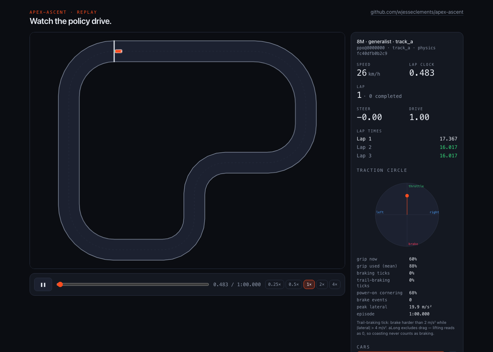

# FINDINGS.md — apex-ascent

What a PPO agent learned about driving a 2D track under traction-circle
physics, and what it took to find out. Companion to [TUNING_LOG.md](TUNING_LOG.md)
(every run, hypothesis first, verdict after) and the app
(replay, checkpoint gallery, traction-circle widget, live driving). Successor
to [apex-evolve](https://github.com/wjesseclements/apex-evolve); comparisons
to its genetic algorithm are informal and labelled as such.

Every number below comes from a run directory that records its full config,
seed, git sha and library versions; the ones the text leans on are committed
under `trainer/runs-committed/` and reproduce with two commands (README).

## 1. Headline: trail-braking is a dose-response to drag

The question the project was built to ask: **does PPO discover
trail-braking** — braking while turning, trading longitudinal for lateral
grip on the edge of the traction circle — when the physics makes that the
optimal way through a corner?

The answer is neither yes nor no. It is *whenever braking is worth the grip*,
and the environment decides that:

| drag (1/s) | free deceleration at 30 m/s | braking ticks | trail-braking ticks | brake events / lap | best lap (Track A) |
|---|---|---|---|---|---|
| 0.30 — the SPEC car | 9.0 m/s² | **0 %** (every run, every checkpoint) | **0 %** | 0 | 15.80 s |
| 0.05 | 1.5 m/s² | 22–32 % (two seeds) | **14–21 %** | ~10 | 15.17 s |
| 0.00 | 0 | 27–39 % | **16–29 %** | ~17 | 15.17 s |

Same algorithm (SB3 PPO, defaults except γ = 0.995), same reward (metres of
progress per tick, −10 on a crash), same [64, 64] network, same 16-number
observation, same 5M-step budget. Only how much the environment slows the car
*for free* changes. A "trail-braking tick" means a brake command below
−2 m/s² (`a_long` excludes drag, so lifting reads as zero — verified in the
sim code, not assumed) while carrying more than 4 m/s² of lateral load.

Under the SPEC car, drag alone decelerates the car at 9 m/s² at top speed —
almost half the 20 m/s² grip budget, and free. Every checkpoint of every run
learned the same thing: never touch the brake, ask for a little less throttle
into the corner, let drag do the slowing, and spend the whole budget on
lateral grip. The minimum commanded longitudinal acceleration over a full
60-second episode is *positive* (+0.2 to +4.6 m/s²) for every checkpoint —
they never even lift fully. The scripted reference driver, written to brake,
brakes 58 times per run under the same physics; the instrument sees braking
when it exists.

Remove the free brake (drag 0.05/s, a named physics preset with its own
golden pin and config hash; the SPEC car stayed the default) and the same
recipe brakes on a quarter to a third of all ticks, up to the full 20 m/s²,
and a large share of that braking happens mid-corner. Both seeds. The
no-drag limit pushes it further. The agent read the economics of each
environment correctly all three times.

The hand-written control driver moves the same way: mean drive +0.44 under
the SPEC car, +0.12 at low drag, +0.06 with none.

## 2. What the SPEC car taught the agent

- **Grip utilisation** (mean |a| / A) climbs with training: 28 % at 50k steps,
  63 % at 100k, 80 % at 250k, 86–89 % from 1M on.
- **Peak lateral acceleration pins at the circle's edge (19.8–20.0 m/s²)
  from 100k steps on** — the policy learned to ride the limit laterally
  within the first 100k steps and spent the remaining 19.9M on line and
  throttle modulation (power-on cornering share 34 % → 70 %).
- The first clean laps appear between 100k and 250k steps; the flying lap
  reaches ~16.3 s by 1M and stops improving: **4× the budget (20M vs 5M) bought
  0.10 s**, inside the seed-to-seed spread.

## 3. Generalization is a property of checkpoints, not runs

Track A is all right-handers. Trained on it alone, the γ = 0.99 baseline
crashes at the first left-hander of both unseen tracks (mirrored A, Track B) —
for two of three seeds; the third drives the mirror cleanly having never seen
a left-hander.

With γ = 0.995 the picture changes: the 8M checkpoint of the 20M run
(`e7-gamma0995-20m`, trained on Track A only) drives **all three tracks
clean, 30/30 laps under start jitter** — Track A 16.02 s, mirrored A 16.72 s,
Track B 18.98 s. But within the same run, 1M, 2M, 8M and 18–20M lap Track B
while 6M, 11M, 13M and 16M crash there, and the fastest-on-A checkpoints (13M,
15.80 s) are the non-generalizing ones. Speed on the training track and
transfer to unseen tracks trade off along training with no monotone trend.
Selecting a checkpoint by evaluation on the target — never "latest" — became
part of the method (`select_checkpoint`), and the app's gallery shows the
flip directly (8M vs 13M as ghosts on Track B).

Why γ and not the track mix? Training on A plus its mirror teaches
left-handers (mirror laps clean) but still fails Track B; training on A and B
laps B at 18.13 s but regresses on A — two circuits compete for a [64, 64]
network in 5M steps. A longer horizon (γ 0.995: a reward 3.3 s away counts
as much as one 1.7 s away did) values "slow before the corner you cannot see
the exit of" over "gain 0.4 m this tick", and that policy is track-agnostic.

## 4. Seeds, instability and the checkpoint sweep

- Three seeds of the baseline: best laps 16.02 / 16.15 / 16.18 s, 90/90 clean
  jittered laps. A 0.16 s spread is the noise floor every later comparison is
  held against ("inside the spread = no effect").
- Training with start jitter (E4) produced checkpoints that **alternate**
  between excellent (4.0M: 16.17 s, 15/15 clean) and crashing (3.5M, 5.0M)
  every ~500k steps. The stochastic rollout crash rate oscillating 0 ↔ 1 while
  deterministic evaluations stay clean was visible from the first run; under
  jitter it reaches the deterministic policy. The low-drag seed 1's final
  checkpoint shows the same degradation (crashes, stopped braking) while its
  2M–3M checkpoints are excellent.
- Consequence: every number in this document is from a checkpoint chosen by a
  jittered sweep, and the competence checkpoint (E7 @ 8M) was chosen for
  driving every track rather than for the fastest Track A lap (E7 @ 13M,
  0.22 s quicker, crashes on both unseen tracks).

## 5. What it cost

PPO, on a 16-core Apple M-series laptop, CPU only, 8 subprocess environments,
one torch thread: **~7,000 environment steps per second** end to end
(collection ≈ 30k steps/s in the benchmark; the update dominates). 5M steps ≈
12 minutes; the 20M run ≈ 48 minutes. The whole Slice 6 campaign — eight
5M-step runs and one 20M run — was about 2.5 hours of compute; Slice 8's three
low-drag runs another 38 minutes. Sample efficiency: first clean laps at
~150–250k steps (≈ 40 s of training); competence at 5M.

*Informal GA comparison* (numbers from apex-evolve's FINDINGS, its machine,
its definitions): the GA evaluates 100 cars per generation for 30-second
episodes, ~170 µs per tick for all 100 cars single-threaded, ~40–130× real
time in the browser; its grip-20 champion arrived at generation 98 on seed 42
— at most ~17.6M car-ticks (fewer, since crashed cars stop), a few minutes of
wall-clock. PPO used comparable samples (5M–20M) and far more wall-clock per
sample (the network update, not the sim, is the cost) — and, unlike the GA,
the result is a policy that reads sensors rather than a genome tuned to one
track.

## 6. Informal comparison with the GA champion

| | apex-evolve GA (grip 20, seed 42) | PPO competence (E7 @ 8M) | PPO specialist (E7 @ 13M) | PPO low drag (E8a @ 5M) |
|---|---|---|---|---|
| Track A best lap | 18.83 s (18.17 s on seed 43) | 16.02 s | 15.80 s | 15.17 s |
| unseen Track B | crashes (solo) | 18.98 s, clean | crashes | — |
| brakes? | lifts and coasts; brakes on two entries | never | never | yes, ~10 events/lap |

Two caveats stated up front: our crash rule is the car's *centre* leaving the
surface (the GA used four corners, ≈ 0.9 m stricter per side), and our
episodes are 60 s with jittered evaluation starts. Same tracks, same traction
circle, same 12 m width, same speed range.

## 7. What did not work

- Entropy coefficient 0.01: no effect on anything measured.
- Training with start jitter at 5M steps: the instability above; a curriculum
  would be needed for a fair test.
- γ 0.995 **plus** the mirror track: worse than either alone — capacity spent
  on left-handers came out of the corner-approach behaviour that transfers.
- More steps: 20M vs 5M, 0.10 s.

## 8. Surprises and method notes

- **Drag as a free brake** was not a bug; it was the SPEC's physics. The
  observation that turned the headline came from watching the trail colour
  in the Slice 5 replay — the throttle never went red — before any metric
  existed.
- **Uniform random actions never crash** (mean drive ≈ 0, brake 20 > throttle
  12): the car dithers on the line. The "random policy crashes fast" sanity
  check had to be redefined with the throttle held.
- **Python↔TypeScript parity**: the sim ported module-for-module, replayed
  Python-recorded action tapes at every tick — maximum position drift
  **1.9e-13 m** against the SPEC's 1 cm budget, observations bit-identical.
  Live driving in the browser runs that sim with the ONNX-exported policy
  (verified against SB3 to 1e-5).
- Exporting `t` at 6 decimals broke the app's O(1) index (`t = i·dt` must be
  exact); `-0.0` in files failed an exact test; hashing the whole env config
  changed a "physics" hash when jitter was added. Each became a test.
- The jittered clean-lap rate first read 35/35 because a start behind the
  line counted an instant lap — a real bug, found by the new instrument.
- A CLI flag that silently did nothing was caught only because the *control*
  row of a table came out identical across conditions. Controls earn their keep.

## 9. Limits and open questions

- Two tracks, one car model, one observation design; γ was the only
  hyperparameter that mattered here and it was not swept finely.
- The instability under jittered training and the checkpoint-fickle
  generalization are described, not explained; late learning-rate decay is
  the untested hypothesis.
- Trail-braking was measured by thresholds chosen before the low-drag runs;
  a continuous measure (how far into the brake half of the circle the mean
  cornering point sits) would tell the same story with fewer knobs.
- The low-drag result rests on two seeds at 5M steps; the no-drag limit on one.
